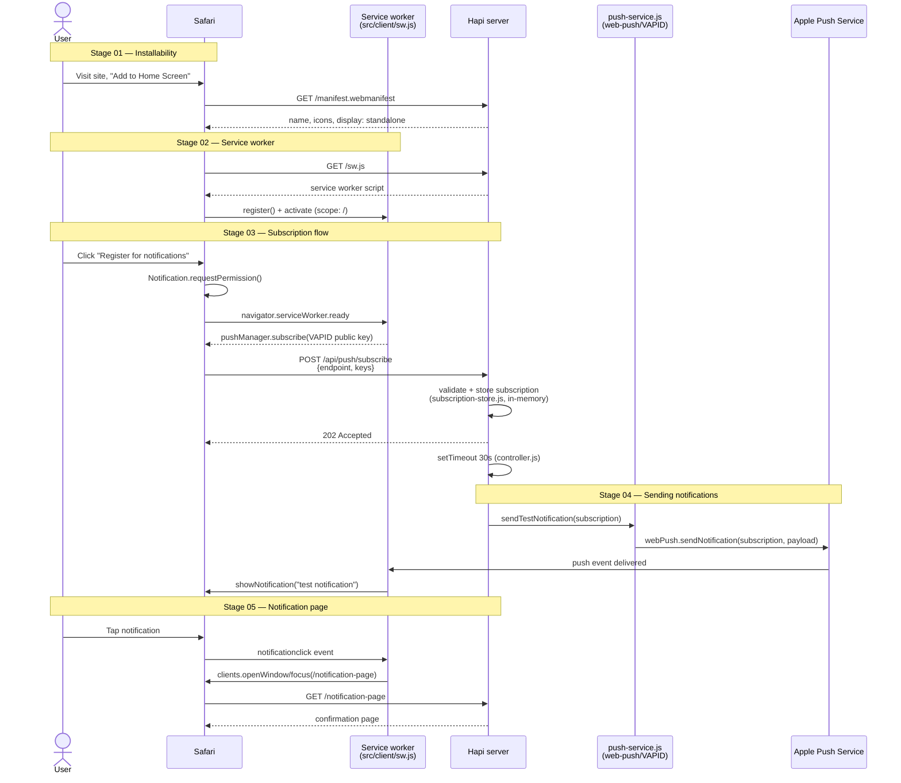

# Stage 00 — Overview

## Goal

Prove, with the minimum amount of code, that this Hapi.js + GOV.UK Frontend service can:

1. Be installed as a PWA from Safari (macOS locally, iOS/iPadOS once deployed to `dev`).
2. Let a user click **"Register for notifications"**.
3. Send that user a native push notification (_"test notification"_) ~30 seconds later.
4. Open a **`/notification-page`** when that notification is tapped.

This is a proof of concept for the _steps involved_, not a production feature. See
`AGENTS.md` for the guardrails that keep it minimal, and `adr/` for the rationale behind
the key technical choices.

## Why standard Web Push works here

Apple's WebKit team confirmed that Safari 16.1+ (macOS) and iOS/iPadOS 16.4+ support push
notifications for home-screen-installed web apps using the same **W3C Web Push
standard** used elsewhere on the web — Web App Manifest, Service Workers, the Push API
and Notifications API — routed through Apple's push service, with no proprietary SDK or
Apple Developer account required.
Source: <https://webkit.org/blog/13878/web-push-for-web-apps-on-ios-and-ipados/>

This means the whole POC can be built with the standard `web-push` npm library (VAPID)
rather than any vendor-specific push SDK — see
`adr/using-standard-web-push-protocol.adr.md`.

## System flow

The diagram below walks through the whole install → register → notify → click-through
journey and which file is responsible for each step.

Key points to keep in mind while reading the code:

- Everything left of "Stage 04" happens in the **browser tab**; `sw.js` runs in a
  separate **service worker context** that outlives the tab (that's what lets it receive
  a push and show a notification even if the site isn't open).
- The 30-second delay is a plain `setTimeout` in
  `src/server/routes/push/controller.js` — there's no queue/scheduler (see
  `adr/storing-push-subscriptions-in-memory.adr.md`).
- `push-service.js` never talks to the browser directly — it hands the payload to the
  `web-push` library, which encrypts it and posts it to the browser vendor's push
  service (Apple's, in Safari's case); that service is what actually wakes the device.
- The server only ever holds one subscription at a time ("last registered wins") — this
  is a single-tester POC, not a multi-user system.

## Constraints confirmed for this POC

- **Local dev:** desktop macOS Safari against `localhost` — service workers treat
  `localhost` as a secure context, so no HTTPS/tunnel is needed for this stage.
- **Device testing:** happens after deploying to the CDP `dev` environment, which is
  already HTTPS and reachable from a phone — no ngrok/tunnel setup needed.
- **Subscription storage:** in-memory only, single instance (see
  `adr/storing-push-subscriptions-in-memory.adr.md`).
- **VAPID keys:** generated once, injected via environment variables (see
  `adr/managing-vapid-keys-via-environment-variables.adr.md`).
- **Scope:** a single global "last registered wins" subscription is acceptable — no
  multi-user support, no unsubscribe flow, no persistence across restarts.
- **No offline support / caching strategy** — the service worker exists only to receive
  push events and handle notification clicks.

## Stage sequence

| Stage | File                                     | Summary                                                                                  |
| ----- | ---------------------------------------- | ---------------------------------------------------------------------------------------- |
| 01    | `01-installability.md`                   | Web App Manifest, icons, meta tags so the site is installable from Safari                |
| 02    | `02-service-worker.md`                   | Root-scoped service worker: registration, `push` handler, `notificationclick` handler    |
| 03    | `03-subscription-flow.md`                | "Register for notifications" button, permission + subscribe, POST subscription to server |
| 04    | `04-sending-notifications.md`            | `web-push` dependency, VAPID config, 30s scheduled send of the test notification         |
| 05    | `05-notification-page.md`                | New `/notification-page` route (heading + lorem ipsum) as the click target               |
| 06    | `06-testing-and-docs.md`                 | Unit tests for new code, manual test scripts (macOS + iOS), README/AGENTS.md updates     |
| 07    | `07-stretch-geolocation.md` _(optional)_ | Gate the notification send on the user's geolocation being within a configurable area    |

Stages should be implemented in order 01→06; stage 07 is an optional stretch goal that
can be picked up independently once the core flow (01–06) works end to end.

## Definition of done (core POC, stages 01–06)

- The site can be added to the Home Screen from Safari (macOS locally; iOS/iPadOS on `dev`).
- Clicking "Register for notifications" prompts for notification permission and stores a
  subscription server-side.
- ~30 seconds later, a system notification titled/bodied "test notification" appears.
- Tapping the notification opens/focuses the app at `/notification-page`, showing a
  "Notification page" heading and lorem ipsum body text.
- New server-side logic has unit tests, and `npm run lint`, `npm run format:check`, and
  `npm test` all pass.
